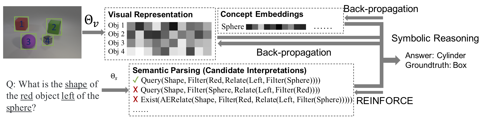

# NSCL-PyTorch-Release
Pytorch implementation for the Neuro-Symbolic Concept Learner (NS-CL).

<div align="center">
  
</div>

**[The Neuro-Symbolic Concept Learner: Interpreting Scenes, Words, and Sentences From Natural Supervision
](http://nscl.csail.mit.edu/data/papers/2019ICLR-NSCL.pdf)**
<br />
[Jiayuan Mao](http://jiayuanm.com), 
[Chuang Gan](http://people.csail.mit.edu/ganchuang/), 
[Pushmeet Kohli](https://sites.google.com/site/pushmeet/),
[Joshua B. Tenenbaum](https://web.mit.edu/cocosci/josh.html), and
[Jiajun Wu](https://jiajunwu.com/)
<br />
In International Conference on Learning Representations (ICLR) 2019 **(Oral Presentation)**
<br />
[[Paper]](http://nscl.csail.mit.edu/data/papers/2019ICLR-NSCL.pdf)
[[Project Page]](http://nscl.csail.mit.edu/)
[[BibTex]](http://nscl.csail.mit.edu/data/bibtex/2019ICLR-NSCL.bib)

```
@inproceedings{Mao2019NeuroSymbolic,
	title={{The Neuro-Symbolic Concept Learner: Interpreting Scenes, Words, and Sentences From Natural Supervision}},
	author={Mao, Jiayuan and Gan, Chuang and Kohli, Pushmeet and Tenenbaum, Joshua B and Wu, Jiajun},
	booktitle={International Conference on Learning Representations},
	year={2019},
	url={https://openreview.net/forum?id=rJgMlhRctm}
}
```

## Prerequisites

- Python 3
- PyTorch 1.0 or higher, with NVIDIA CUDA Support
- Other required python packages specified by `requirements.txt`. See the Installation.

## Installation

Install [Jacinle](https://github.com/vacancy/Jacinle): Clone the package, and add the bin path to your global `PATH` environment variable:

```
git clone https://github.com/vacancy/Jacinle --recursive
export PATH=<path_to_jacinle>/bin:$PATH
```

Clone this repository:

```
git clone https://github.com/vacancy/NSCL-PyTorch-Release --recursive
```

Create a conda environment for NS-CL, and install the requirements. This includes the required python packages
from both Jacinle NS-CL. Most of the required packages have been included in the built-in `anaconda` package:

```
conda create -n nscl anaconda
conda install pytorch torchvision -c pytorch
```

## Dataset preparation

To replicate the experiments, you need to prepare your dataset as the following. Taking the CLEVR dataset as an example.

```
clevr
├── train
│   ├── images
│   ├── questions.json
│   ├── scenes-raw.json
│   └── scenes.json
│   └── vocab.json
└── val
    ├── images
    ├── questions.json
    ├── scenes-raw.json
    └── scenes.json
    └── vocab.json
```

You can download all images, and put them under the `images/` folders from the [official website](https://cs.stanford.edu/people/jcjohns/clevr/) of the CLEVR dataset.
The `questions.json` and `scenes-raw.json` could also been found on the website.

Next, you need to add object detection results for scenes. Here, we use the tools provided by [ns-vqa](https://github.com/kexinyi/ns-vqa).
In short, a pre-trained Mask-RCNN is used to detect all objects. We provide the json files with detected object bounding boxes at [clevr/train/scenes.json](http://nscl.csail.mit.edu/data/code-data/clevr/train/scenes.json.zip) and [clevr/val/scenes.json](http://nscl.csail.mit.edu/data/code-data/clevr/val/scenes.json.zip).

The `vocab.json` could be downloaded at [this URL](http://nscl.csail.mit.edu/data/code-data/clevr/vocab.json).

## Training and evaluation.

**Note**: This current release contains only training codes for the visual modules. That is, currently we still assume that
a semantic parser is pre-trained using program annotations. In the full NS-CL, this pre-training is not required. We also plan to release the full training code soon.

To train the model:
```
jac-crun <gpu_id> scripts/trainval.py --desc experiments/clevr/desc_nscl_derender.py --training-target derender --curriculum all --dataset clevr --data-dir <data_dir>/clevr/train --batch-size 32 --epoch 100 --validation-interval 5 --save-interval 5 --data-split 0.95
```
The `--data-split 0.95` specifies that five percent of the training data will be held out as the develop set. Since the annotation for the test split is not available for the CLEVR dataset, we will test our model on the original validation split.
A sample training log is provided at [this URL](http://nscl.csail.mit.edu/data/code-data/clevr/log/run-2019-04-07-16-25-45.log). A pretrained model is available at [this URL](http://nscl.csail.mit.edu/data/code-data/clevr/model/derender-curriculum_all-qtrans_off-clevrfull-epoch_100.pth).

To test on the validation split, you need to download the `clevr/val/questions.json` that includes parsed programs at [this URL](http://nscl.csail.mit.edu/data/code-data/clevr/val/questions.json.zip). Note that since we do not include any annotated programs during training, the parsed programs in this file can be different from the original CLEVR dataset (due to the "equivalence" between programs).
```
jac-crun <gpu_id> scripts/trainval.py --desc experiments/clevr/desc_nscl_derender.py --training-target derender --curriculum all --dataset clevr --data-dir <data_dir>/clevr/train --data-split 0.95 --extra-data-dir data/clevr/val --evaluate --load dumps/clevr/desc_nscl_derender/derender-curriculum_all-qtrans_off/checkpoints/epoch_100.pth
```
Here, we input the CLEVR validation split as an `--extra-data-dir`, so the performance on the CLEVR validation split will be shown as the accuracy on the extra dataset split.

Example output (`validation/acc/qa` denotes the performance on the held-out dev set, while `validation_extra/acc/qa` denotes the performance on the official validation split):
```
validation/acc/qa = 0.994886
validation/acc/qa/count = 0.989113
validation/acc/qa/count_equal = 0.993470
validation/acc/qa/count_greater = 0.999275
validation/acc/qa/count_less = 0.998321
validation/acc/qa/exist = 0.996974
validation/acc/qa/query = 0.997189
validation/acc/qa/query_attribute_equal = 0.995861

# performance on CLEVR's validation set.
validation_extra/acc/qa = 0.996146
validation_extra/acc/qa/count = 0.992547
validation_extra/acc/qa/count_equal = 0.993377
validation_extra/acc/qa/count_greater = 0.996390
validation_extra/acc/qa/count_less = 0.998373
validation_extra/acc/qa/exist = 0.997652
validation_extra/acc/qa/query = 0.997664
validation_extra/acc/qa/query_attribute_equal = 0.996723
```
